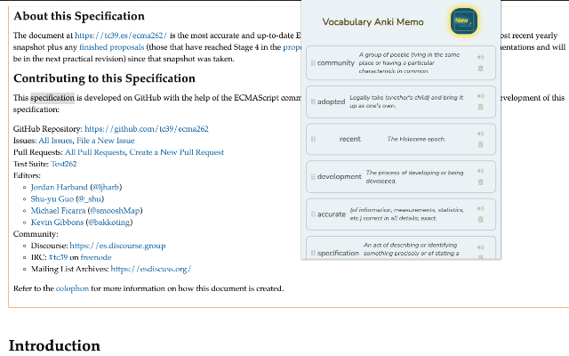
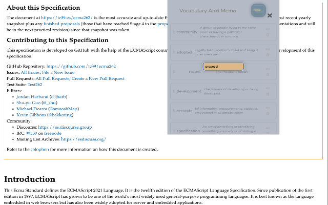

# vocabulary-anki-memo

## Features

It's your English vocabulary memo. You can create your own vocabulary list.
Vocabulary anki Notebook is the simplest English memo for your Chrome browser.

No other complex un-need functionalities, simply search, add, check the pronunciation, memorize and remove! 
- add new vocabulary from the context menu and vocabulary add modal.
- drag and drop to modify vocabulary order
- sync with google account
- fantastic accessibility that is fully controllable by keyboard

`ctrl` , `⌘` + `Enter` , `delete` to toggle vocabulary add modal and `tab` , `Enter` for others.

## Preview

----

Get it from [chrome web store](https://chrome.google.com/webstore/detail/vocabulary-anki-memo/jblgpemdpeplkdmkgfggacgfdaofjpjh/related) now!